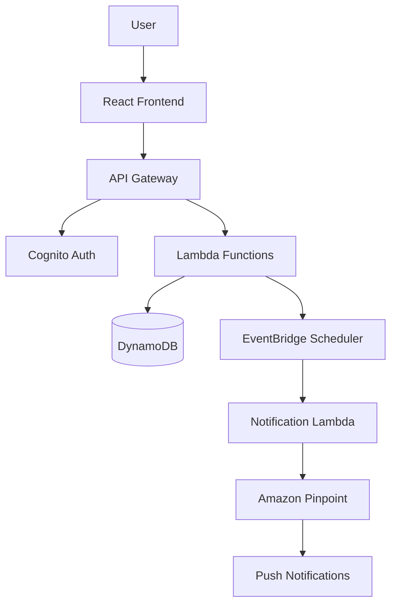

# Design Document

## Overview

川田を可愛がるゲーム＋スケジュール管理アプリは、React フロントエンドと AWS サーバーレスバックエンドを使用したモダンなウェブアプリケーションです。決まった会話パターンを使用することで、LLM コストを抑えながら一貫したキャラクター体験を提供します。

## Architecture

### Technology Stack

**Frontend:**
- React with Next.js
- Tailwind CSS for styling
- TypeScript for type safety

**Backend & Infrastructure:**
- AWS Amplify (hosting + CI/CD)
- Amazon Cognito (authentication)
- AWS Lambda (API functions)
- Amazon DynamoDB (data storage)
- Amazon EventBridge Scheduler (reminders)
- Amazon Pinpoint (push notifications)

**Development:**
- Kiro for spec-driven development
- Git for version control

### System Architecture



## Components and Interfaces

### Frontend Components

**ChatInterface**
- ChatWindow: メッセージ表示とスクロール
- MessageInput: ユーザー入力
- AffinityGauge: 好感度表示ゲージ
- KawadaAvatar: 川田のアバター表示

**GiftInterface**
- GiftShop: 利用可能ギフト一覧
- GiftItem: 個別ギフト表示
- GiftHistory: 贈り物履歴

**QuizInterface**
- QuizQuestion: 問題表示
- QuizChoices: 選択肢ボタン
- QuizResult: 結果表示

**ReminderInterface**
- ReminderSettings: リマインダー設定
- ScheduleList: 設定済みスケジュール一覧

**AdminInterface**
- UserList: ユーザー一覧
- UserDetail: ユーザー詳細情報
- Analytics: 簡易統計

### API Endpoints

```typescript
// Chat API
POST /api/chat
Request: { userId: string, trigger: string }
Response: { lines: string[], affinityDelta: number }

// Gift API
POST /api/gift
Request: { userId: string, giftId: string }
Response: { success: boolean, affinityDelta: number, message: string }

// Quiz API
GET /api/quiz/random
Response: { quizId: string, question: string, choices: string[] }

POST /api/quiz/answer
Request: { userId: string, quizId: string, answer: number }
Response: { correct: boolean, affinityDelta: number, message: string }

// Reminder API
POST /api/reminder
Request: { userId: string, schedule: string, timezone: string }
Response: { reminderId: string, success: boolean }

// User API
GET /api/user/profile
Response: { userId: string, affinity: number, giftHistory: Gift[], chatHistory: Message[] }
```

## Data Models

### User Profile
```typescript
interface UserProfile {
  userId: string;
  email: string;
  displayName: string;
  timezone: string;
  createdAt: string;
  lastLoginAt: string;
}
```

### Affinity Data
```typescript
interface AffinityData {
  userId: string;
  currentAffinity: number; // 0-100
  lastChatAt: string;
  dailyLoginCount: number;
  lastLoginDate: string;
}
```

### Chat Message
```typescript
interface ChatMessage {
  id: string;
  userId: string;
  role: 'user' | 'kawada';
  text: string;
  trigger?: string;
  createdAt: string;
}
```

### Gift Item
```typescript
interface GiftItem {
  id: string;
  name: string;
  rarity: 'common' | 'uncommon' | 'rare';
  affinityValue: number;
  description: string;
}

interface GiftHistory {
  id: string;
  userId: string;
  giftId: string;
  giftedAt: string;
  affinityGained: number;
}
```

### Quiz Data
```typescript
interface Quiz {
  id: string;
  question: string;
  choices: string[];
  correctAnswer: number;
  category: string;
}

interface QuizResult {
  id: string;
  userId: string;
  quizId: string;
  userAnswer: number;
  correct: boolean;
  affinityChange: number;
  completedAt: string;
}
```

### Reminder Schedule
```typescript
interface ReminderSchedule {
  id: string;
  userId: string;
  cronExpression: string;
  message: string;
  isActive: boolean;
  createdAt: string;
}
```

### Canned Conversations
```typescript
interface CannedConversation {
  id: string;
  trigger: string;
  affinityMin: number;
  affinityMax: number;
  lines: Array<{
    role: 'kawada';
    text: string;
  }>;
}
```

## Error Handling

### Frontend Error Handling
- Network errors: Retry mechanism with exponential backoff
- Authentication errors: Redirect to login
- Validation errors: User-friendly error messages
- Offline handling: Cache last known state

### Backend Error Handling
- Lambda function errors: Structured error responses
- DynamoDB errors: Retry with exponential backoff
- Authentication errors: Return 401 with clear messages
- Validation errors: Return 400 with field-specific errors

### Error Response Format
```typescript
interface ErrorResponse {
  error: {
    code: string;
    message: string;
    details?: any;
  };
}
```

## Testing Strategy

### Unit Testing
- Frontend: Jest + React Testing Library
- Backend: Jest for Lambda functions
- Data models: Validation testing
- Utility functions: Edge case testing

### Integration Testing
- API endpoint testing with mock DynamoDB
- Authentication flow testing
- Push notification testing with mock Pinpoint

### End-to-End Testing
- User registration and login flow
- Complete chat interaction flow
- Gift giving and affinity changes
- Quiz completion flow
- Reminder setting and notification

### Performance Testing
- API response time testing
- DynamoDB query performance
- Frontend rendering performance
- Push notification delivery testing

### Test Data Management
- Mock conversation data for testing
- Test user accounts with various affinity levels
- Sample quiz questions for testing
- Test reminder schedules

## Security Considerations

### Authentication & Authorization
- Cognito JWT token validation
- API Gateway request validation
- User data isolation in DynamoDB

### Data Protection
- Encrypt sensitive data at rest
- Use HTTPS for all communications
- Implement rate limiting on APIs

### Privacy
- Minimal data collection
- Clear data retention policies
- User data deletion capabilities